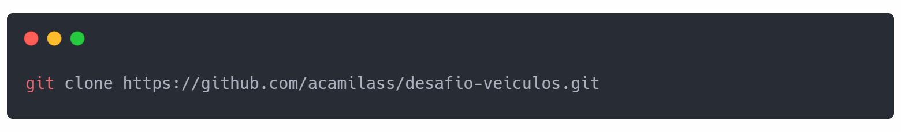
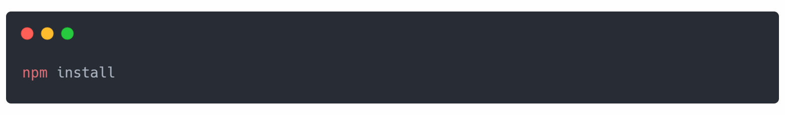
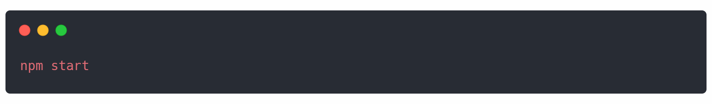

# Teste Frontend Itaú - Comunidade de Veículos

O teste consiste em criar uma busca de veículos na [tabela Fipe](https://fipeapi.appspot.com/). Os requisitos do teste estão descritos no seguinte [link](https://github.com/brunagil/frontend-teste-veiculos).

## Metodologia
**Padrão:** Angular

**Frameworks:** Angular, Angular Material

**Desenvolvedora:** Ana Camila Santos Sousa

**Método de Desenvolvimento:**  A estrutura do projeto foi criada com a ferramenta [angular-cli](https://github.com/angular/angular-cli). Para o front end foi utilizado o framework [Angular Material](https://material.angular.io/). Para hospedar a página na web foi usado o [Netlify Drop](https://app.netlify.com/drop).

## Link do projeto
O projeto também foi hospedado na web usando o Netlify Drop para uma visualização mais rápida. 
> 

## Executando o projeto localmente

O projeto também pode ser clonado através do seu repositório e assim ser visualizado localmente.

**Requisitos:** O Node estar instalado na máquina

### Passos

Através do terminal clone o projeto

Na pasta desafio-veiculos baixe os pacotes

Para executar localmente use o seguinte comando

Agora você pode testar a sua aplicação através do endereço [http://localhost:4200](http://localhost:4200)

